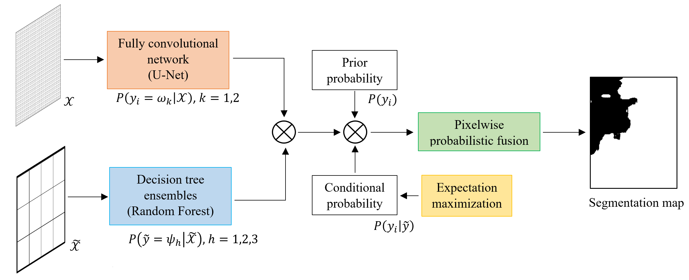
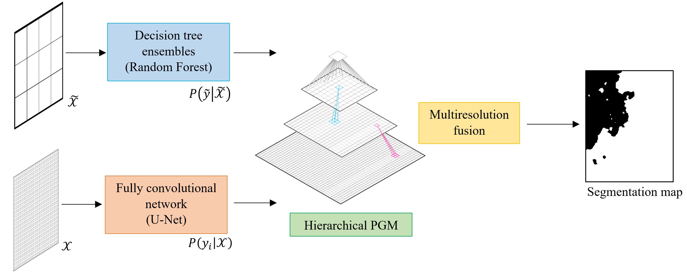

# BAS_UAV_satellite_fusion

## Stay tuned for updates!

Probabilistic Fusion Framework Based on Fully Convolutional Networks and Graphical Models for Burnt Area Detection from Multiresolution Satellite and UAV Imagery

This repository contains the code related to the paper:  

M. Pastorino, G. Moser, F. Guerra, S. B. Serpico, and J. Zerubia, ``Probabilistic Fusion Framework Combining CNNs and Graphical Models for Multiresolution Satellite and UAV Image Classification," in Proceedings of the International Conference on Pattern Recognition (ICPR), 2024 [https://inria.hal.science/hal-04678650v1]( https://inria.hal.science/hal-04678650v1).

and the paper :

M. Pastorino, G. Moser, F. Guerra, S. B. Serpico, and J. Zerubia, ``A multiresolution fusion framework based on probabilistic graphical modeling for burnt zones mapping from satellite and UAV imagery," in Proceedings of the International Geoscience and Remote Sensing Symposium (IGARSS), 2024 [https://inria.hal.science/hal-04678650v1]( https://inria.hal.science/hal-04678650v1).
