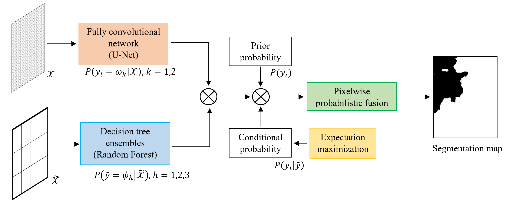
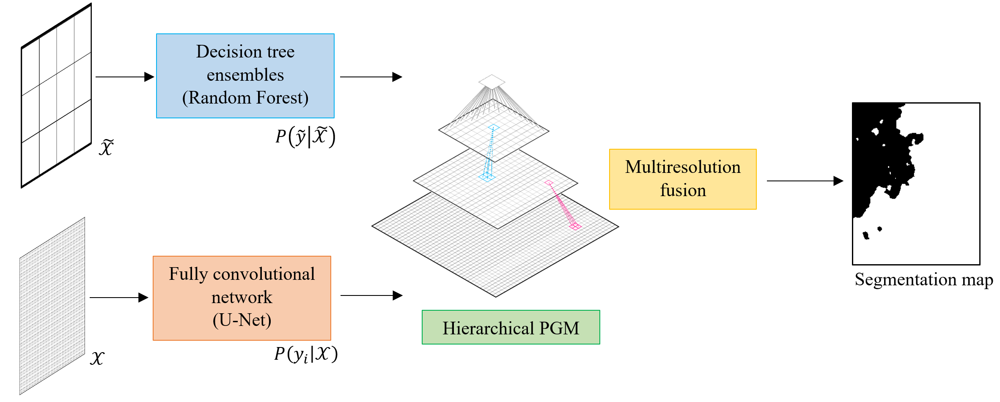

# BAS_UAV_satellite_fusion

Probabilistic Fusion Framework Based on Fully Convolutional Networks and Graphical Models for Burned Area Detection from Multiresolution Satellite and UAV Imagery


(a) Probabilistic decision fusion (DF-FCN)


(b) Multiresolution fusion through hierarchical probabilistic graphical model (PGF-FCN)

This repository contains the code related to the journal paper:  

M. Pastorino, G. Moser, F. Guerra, S. B. Serpico and J. Zerubia, ``Probabilistic Fusion Framework Based on Fully Convolutional Networks and Graphical Models for Burned Area Detection From Multiresolution Satellite and UAV Imagery," in IEEE Transactions on Geoscience and Remote Sensing, vol. 64, pp. 1-19, 2026, Art no. 4702919, doi: 10.1109/TGRS.2026.3676291. 

and the conference papers :

M. Pastorino, G. Moser, F. Guerra, S. B. Serpico, and J. Zerubia, ``Probabilistic Fusion Framework Combining CNNs and Graphical Models for Multiresolution Satellite and UAV Image Classification," in Proceedings of the International Conference on Pattern Recognition (ICPR), 2024 [https://inria.hal.science/hal-04678650v1]( https://inria.hal.science/hal-04678650v1).

M. Pastorino, G. Moser, F. Guerra, S. B. Serpico, and J. Zerubia, ``A multiresolution fusion framework based on probabilistic graphical modeling for burnt zones mapping from satellite and UAV imagery," in Proceedings of the International Geoscience and Remote Sensing Symposium (IGARSS), 2024 [https://inria.hal.science/hal-04678650v1]( https://inria.hal.science/hal-04678650v1).


## 🧰 Install

```bash
pip install -e .
```

## 🏃‍♂️ Run Method 1

1. Train or load a Random Forest to compute Sentinel-2 posteriors.
2. Train or load a `UNet` to compute drone posteriors at 2 cm.
3. Fuse the two posterior maps with the pixelwise probabilistic fusion rule.

```bash
python scripts/run_method1.py --config configs/method1.example.yaml
```

## 🏃‍♀️ Run Method 2

1. Train or load a Random Forest to compute Sentinel-2 posteriors.
2. Train or load a `UNet2` to compute drone posteriors at 2 cm, 4 cm, and 8 cm.
3. Fuse the multiresolution posterior maps with the MRF routine.

```bash
python scripts/run_method2.py --config configs/method2.example.yaml
```

## 📔 Config notes

The example configs train RF and U-Net models by default. To reuse trained models, replace `train_labels` with `model` for RF, or replace `train_labels` with `checkpoint` for U-Net.

For Sentinel-2 RF blocks:

```yaml
sentinel2:
  source: rf
  image: data/sentinel2_image.npy
  train_labels: data/sentinel2_labels.npy
  save_model: outputs/rf_sentinel2.pkl
```

or, to use an existing RF:

```yaml
sentinel2:
  source: rf
  image: data/sentinel2_image.npy
  model: outputs/rf_sentinel2.pkl
```

For U-Net blocks:

```yaml
drone:
  source: unet
  image: data/drone_image.npy
  train_labels: data/drone_labels.npy
  variant: unet
  save_checkpoint: outputs/unet.pt
```

or, to use an existing checkpoint:

```yaml
drone:
  source: unet
  image: data/drone_image.npy
  checkpoint: outputs/unet.pt
  variant: unet
```

## :new_moon_with_face: License

The code is released under the GPL-3.0-only license. See `LICENSE.md` for more details.


## :eyes: Acknowledgements

If you use our code, please cite the following paper:

`@ARTICLE{11449307,
  author={Pastorino, Martina and Moser, Gabriele and Guerra, Fabien and Serpico, Sebastiano B. and Zerubia, Josiane},
  journal={IEEE Transactions on Geoscience and Remote Sensing}, 
  title={Probabilistic Fusion Framework Based on Fully Convolutional Networks and Graphical Models for Burned Area Detection From Multiresolution Satellite and UAV Imagery}, 
  year={2026},
  volume={64},
  pages={1-19},
  doi={10.1109/TGRS.2026.3676291}}'

This work was conducted during my joint PhD at [INRIA](https://team.inria.fr/ayana/team-members/), d'Université Côte d'Azur and at the [University of Genoa](http://phd-stiet.diten.unige.it/). 
The UAV drone images were acquired by INRAE (Institut National de Recherche pour l'Agriculture, l'Alimentation et l'Environnement), RECOVER, Provence-Alpes-Côte d'Azur research centre, Aix-en-Provence.
The Sentinel-2 mission is part of the European Union Copernicus programme for Earth observations. The images are open access at [Copernicus Data Space Ecosystem](https://dataspace.copernicus.eu/).

**Disclaimer**: the code was cleaned before release using an LLM (and double checked), for any bug, contact the author.
